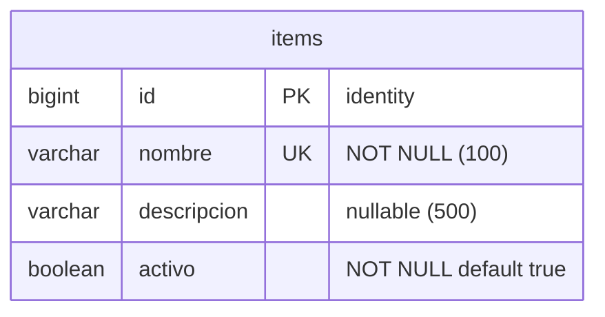

# Esquema de la base de datos

Diagrama entidad-relación de la base (PostgreSQL / Supabase). Fuente de verdad: [`init_db.sql`](init_db.sql).

## Notas

- **`items`** es el recurso de ejemplo de este proyecto base (CRUD completo). `nombre` es único
  (409 al chocar); `descripcion` es opcional; `activo` es un booleano con default `true`.
- **No hay tabla de usuarios**: el único admin se configura por variables de entorno
  (`ADMIN_USER` / `ADMIN_PASSWORD`).
- Para agregar un recurso nuevo, replicá el patrón de `items` en las cuatro capas
  (`db → validators → services → routes`) y sumá su tabla acá y en `init_db.sql`.
