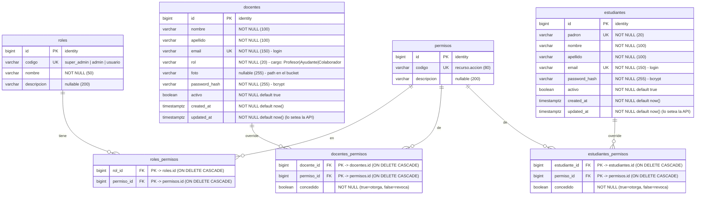

# Esquema de la base de datos

Diagrama entidad-relación de la base (PostgreSQL / Supabase). Fuente de verdad: [`init_db.sql`](init_db.sql).

## Notas

- **RBAC con rol derivado.** El rol de seguridad de una persona no se guarda como FK: se **deriva**.
  - `docentes`: el `rol` (cargo) determina el rol RBAC → `Profesor` = `super_admin`;
    `Ayudante` / `Colaborador` = `admin` (ver `CARGO_A_ROL` en `constants.py`).
  - `estudiantes`: siempre `usuario`.
- **`roles` / `permisos` / `roles_permisos`** definen, a nivel general y configurable, qué permisos
  tiene cada rol. `roles_permisos` es la matriz rol→permiso.
- **Overrides por usuario** (`docentes_permisos`, `estudiantes_permisos`): excepciones individuales.
  `concedido = true` **otorga** un permiso extra; `concedido = false` **revoca** uno del rol.
  Permiso efectivo = permisos del rol ∪ otorgados − revocados.
- **Autenticación propia (monolito).** `docentes` y `estudiantes` guardan `password_hash` (bcrypt) y
  se autentican por `email` + password. No hay tabla de usuarios aparte.
- **Auditoría.** `created_at` / `updated_at` en `docentes` y `estudiantes`. `created_at` usa
  `DEFAULT now()` al insertar; **`updated_at` lo setea la API** en cada update (capa `db`), sin
  trigger en la base.
- **Campos de valor fijo como `VARCHAR`** (no `ENUM`): validación en Python (`constants.py` +
  validators), por portabilidad.
  - `docentes.rol` ∈ `Profesor` | `Ayudante` | `Colaborador`
  - `roles.codigo` ∈ `super_admin` | `admin` | `usuario`
  - `permisos.codigo` con formato `recurso.accion` (ej. `docentes.gestionar`)
- **Seed**: `roles`, `permisos` y su matriz `roles_permisos`; docentes bootstrap (password
  `admin123`) y el padrón de estudiantes de la cursada (password `cambiar123`). Cambiar en el primer
  acceso.
