# Esquema de la base de datos

Diagrama entidad-relación de la base (PostgreSQL / Supabase). Fuente de verdad: [`init_db.sql`](init_db.sql).

```mermaid
erDiagram
    roles {
        bigint   id          PK "identity"
        varchar  codigo      UK "super_admin | admin | usuario"
        varchar  nombre         "NOT NULL (50)"
        varchar  descripcion    "nullable (200)"
    }

    permisos {
        bigint   id          PK "identity"
        varchar  codigo      UK "recurso.accion (80)"
        varchar  descripcion    "nullable (200)"
    }

    roles_permisos {
        bigint   rol_id      FK "PK -> roles.id (ON DELETE CASCADE)"
        bigint   permiso_id  FK "PK -> permisos.id (ON DELETE CASCADE)"
    }

    docentes {
        bigint      id            PK "identity"
        varchar     nombre           "NOT NULL (100)"
        varchar     apellido         "NOT NULL (100)"
        varchar     email         UK "NOT NULL (150) - login"
        varchar     rol              "NOT NULL (20) - cargo: Profesor|Ayudante|Colaborador"
        varchar     foto             "nullable (255) - path en el bucket"
        varchar     password_hash    "NOT NULL (255) - bcrypt"
        boolean     activo           "NOT NULL default true"
        timestamptz created_at       "NOT NULL default now()"
        timestamptz updated_at       "nullable - null al crear; la API lo setea al actualizar"
    }

    estudiantes {
        bigint      id            PK "identity"
        varchar     padron        UK "NOT NULL (20)"
        varchar     nombre           "NOT NULL (100)"
        varchar     apellido         "NOT NULL (100)"
        varchar     email         UK "NOT NULL (150) - login"
        varchar     password_hash    "NOT NULL (255) - bcrypt"
        boolean     activo           "NOT NULL default true"
        timestamptz created_at       "NOT NULL default now()"
        timestamptz updated_at       "nullable - null al crear; la API lo setea al actualizar"
    }

    docentes_permisos {
        bigint   docente_id    FK "PK -> docentes.id (ON DELETE CASCADE)"
        bigint   permiso_id    FK "PK -> permisos.id (ON DELETE CASCADE)"
        boolean  concedido        "NOT NULL (true=otorga, false=revoca)"
    }

    estudiantes_permisos {
        bigint   estudiante_id FK "PK -> estudiantes.id (ON DELETE CASCADE)"
        bigint   permiso_id    FK "PK -> permisos.id (ON DELETE CASCADE)"
        boolean  concedido        "NOT NULL (true=otorga, false=revoca)"
    }

    materias {
        bigint   id          PK "identity"
        varchar  codigo      UK "NOT NULL (20)"
        varchar  nombre         "NOT NULL (150)"
        varchar  descripcion    "nullable (500)"
    }

    cursadas {
        bigint      id           PK "identity"
        bigint      materia_id   FK "-> materias.id (ON DELETE CASCADE)"
        smallint    anio            "NOT NULL"
        smallint    cuatrimestre    "NOT NULL (1|2)"
        date        fecha_inicio    "NOT NULL"
        date        fecha_fin       "NOT NULL"
        timestamptz created_at      "NOT NULL default now()"
        timestamptz updated_at      "nullable (la API)"
    }

    inscripciones {
        bigint      id            PK "identity"
        bigint      cursada_id    FK "-> cursadas.id (ON DELETE CASCADE)"
        bigint      estudiante_id FK "-> estudiantes.id (ON DELETE CASCADE)"
        boolean     recursa          "NOT NULL default false"
        varchar     estado           "cursando | abandono | baja (default cursando)"
        varchar     motivo_baja      "nullable - razon de la baja"
        timestamptz created_at       "NOT NULL default now()"
        timestamptz updated_at       "nullable (la API)"
    }

    cursada_docentes {
        bigint      cursada_id FK "PK -> cursadas.id (ON DELETE CASCADE)"
        bigint      docente_id FK "PK -> docentes.id (ON DELETE CASCADE)"
    }

    evaluaciones {
        bigint      id          PK "identity"
        bigint      cursada_id  FK "-> cursadas.id (ON DELETE CASCADE)"
        varchar     nombre         "NOT NULL (150)"
        varchar     descripcion    "nullable (500)"
        varchar     tipo           "obligatorio | opcional"
        varchar     criterio       "nota | aprobado_desaprobado | entregado_no_entregado"
        numeric     peso           "NOT NULL default 0 (promedio)"
        varchar     modalidad      "grupal | individual"
        varchar     visibilidad    "habilitado | deshabilitado | sin_entrega"
        timestamptz created_at     "NOT NULL default now()"
        timestamptz updated_at     "nullable (la API)"
    }

    grupos {
        bigint      id            PK "identity"
        bigint      evaluacion_id FK "-> evaluaciones.id (ON DELETE CASCADE)"
        smallint    numero           "NOT NULL (unico por evaluacion)"
        varchar     nombre           "NOT NULL (150)"
        bigint      owner_id      FK "-> estudiantes.id (creador)"
        bigint      tutor_id      FK "-> docentes.id (nullable)"
        timestamptz created_at       "NOT NULL default now()"
        timestamptz updated_at       "nullable (la API)"
    }

    grupo_estudiantes {
        bigint   grupo_id      FK "PK -> grupos.id (ON DELETE CASCADE)"
        bigint   estudiante_id FK "PK -> estudiantes.id (ON DELETE CASCADE)"
    }

    notas {
        bigint      id            PK "identity"
        bigint      evaluacion_id FK "-> evaluaciones.id (ON DELETE CASCADE)"
        bigint      estudiante_id FK "-> estudiantes.id (ON DELETE CASCADE)"
        numeric     nota             "nullable (criterio=nota)"
        varchar     estado           "nullable (aprobado/entregado/...)"
        varchar     observaciones    "nullable (500)"
        timestamptz created_at       "NOT NULL default now()"
        timestamptz updated_at       "nullable (la API)"
    }

    notas_grupo {
        bigint      id         PK "identity"
        bigint      grupo_id   FK "-> grupos.id (ON DELETE CASCADE, unico)"
        numeric     nota          "nullable (criterio=nota)"
        varchar     estado        "nullable"
        varchar     observaciones "nullable (500)"
        timestamptz created_at    "NOT NULL default now()"
        timestamptz updated_at    "nullable (la API)"
    }

    roles       ||--o{ roles_permisos       : "tiene"
    permisos    ||--o{ roles_permisos       : "en"
    docentes    ||--o{ docentes_permisos    : "override"
    permisos    ||--o{ docentes_permisos    : "de"
    estudiantes ||--o{ estudiantes_permisos : "override"
    permisos    ||--o{ estudiantes_permisos : "de"

    materias    ||--o{ cursadas          : "se dicta en"
    cursadas    ||--o{ inscripciones     : "tiene"
    estudiantes ||--o{ inscripciones     : "cursa"
    cursadas    ||--o{ cursada_docentes  : "plantel"
    docentes    ||--o{ cursada_docentes  : "dicta"
    cursadas    ||--o{ evaluaciones      : "define"
    evaluaciones||--o{ grupos            : "arma (si es grupal)"
    estudiantes ||--o{ grupos            : "owner"
    docentes    ||--o{ grupos            : "tutoriza"
    grupos      ||--o{ grupo_estudiantes : "integra"
    estudiantes ||--o{ grupo_estudiantes : "miembro"
    evaluaciones||--o{ notas             : "nota individual"
    estudiantes ||--o{ notas             : "recibe"
    grupos      ||--o| notas_grupo       : "nota de grupo"
```

## Notas

- **RBAC con rol derivado.** El rol de seguridad de una persona no se guarda como FK: se **deriva**.
  - `docentes`: el `rol` (cargo) determina el rol RBAC → `Profesor` = `super_admin`;
    `Ayudante` / `Colaborador` = `admin` (ver `CARGO_A_ROL` en `constants.py`).
  - `estudiantes`: siempre `usuario`.
- **`roles` / `permisos` / `roles_permisos`** definen, a nivel general y configurable, qué permisos
  tiene cada rol. `roles_permisos` es la matriz rol→permiso.
- **Overrides por usuario** (`docentes_permisos`, `estudiantes_permisos`): excepciones individuales.
  `concedido = true` **otorga** un permiso extra; `concedido = false` **revoca** uno del rol.
  Permiso efectivo = permisos del rol ∪ otorgados − revocados.
- **Autenticación propia (monolito).** `docentes` y `estudiantes` guardan `password_hash` (bcrypt) y
  se autentican por `email` + password. No hay tabla de usuarios aparte.
- **Auditoría.** `created_at` / `updated_at` en `docentes` y `estudiantes`. `created_at` lo setea la
  API al crear (con `DEFAULT now()` como red de seguridad). `updated_at` queda **NULL al crear**
  (todavía no se actualizó) y la API lo setea en cada update. No hay trigger en la base.
- **Campos de valor fijo como `VARCHAR`** (no `ENUM`): validación en Python (`constants.py` +
  validators), por portabilidad.
  - `docentes.rol` ∈ `Profesor` | `Ayudante` | `Colaborador`
  - `roles.codigo` ∈ `super_admin` | `admin` | `usuario`
  - `permisos.codigo` con formato `recurso.accion` (ej. `docentes.gestionar`)
  - `inscripciones.estado` ∈ `cursando` | `abandono` | `baja`
  - `evaluaciones.tipo` ∈ `obligatorio` | `opcional`
  - `evaluaciones.criterio` ∈ `nota` | `aprobado_desaprobado` | `entregado_no_entregado`
  - `evaluaciones.modalidad` ∈ `grupal` | `individual`
  - `evaluaciones.visibilidad` ∈ `habilitado` | `deshabilitado` | `sin_entrega`
- **Seed**: `roles`, `permisos` y su matriz `roles_permisos`; docentes bootstrap (password
  `Prueba123#`) y el padrón de estudiantes de la cursada (password = su padrón); una `materia` y una
  `cursada` de ejemplo. Cambiar los passwords en el primer acceso.

## Dominio de cursada

- **Materia → cursadas**: una `materia` se dicta en varias `cursadas` (una por `anio` +
  `cuatrimestre`; único `(materia_id, anio, cuatrimestre)`, con `cuatrimestre` ∈ {1, 2}). Cada
  cursada tiene `fecha_inicio` y `fecha_fin`; la **cursada vigente** es aquella cuyo período incluye
  la fecha actual (se usa para inscribir al dar de alta estudiantes).
- **Inscripciones**: `cursada` ↔ `estudiante` (único por cursada) con `recursa` y `estado`
  (`cursando`/`abandono`/`baja`). En `baja` se completa `motivo_baja`. No se borra la fila: se cambia
  el estado (traza histórica).
- **Plantel**: `cursada_docentes` vincula docentes por cursada (pueden variar por cuatrimestre). El
  cargo del docente es global (`docentes.rol`), no por cursada.
- **Evaluaciones**: se definen por cursada (tipo, criterio, peso, modalidad, visibilidad). El
  **promedio** considera las de `criterio = 'nota'` según su `peso`.
- **Notas** (resultado polimórfico): `nota` (numérica, para `criterio = 'nota'`) o `estado`
  (`aprobado`/`desaprobado`, `entregado`/`no_entregado`). Individual en `notas` (única por
  evaluación + estudiante).
- **Grupos por evaluación** (para `modalidad = 'grupal'`): `grupos` cuelga de `evaluaciones`
  (`numero` único por evaluación), con `owner` (estudiante creador, obligatorio) y `tutor` (docente,
  opcional). Los miembros están en `grupo_estudiantes`. La nota de grupo es una por grupo
  (`notas_grupo`, `UNIQUE(grupo_id)`). En una evaluación grupal, el estudiante tiene su **nota
  individual** (`notas`) **y** la **nota de su grupo** (`notas_grupo`).
- **Un grupo por estudiante por evaluación**: se valida en el service (no hay constraint en la base).
- **Baja lógica de estudiante**: el DELETE de estudiante es una baja lógica (`estudiantes.activo =
  false`); es distinta de la baja por cursada (`inscripciones.estado = 'baja'`).
