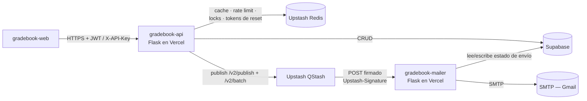
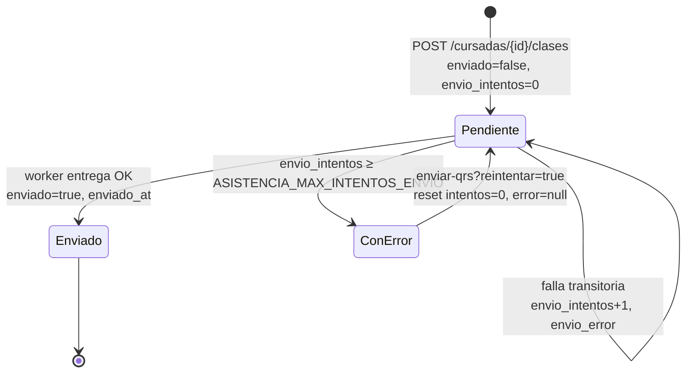
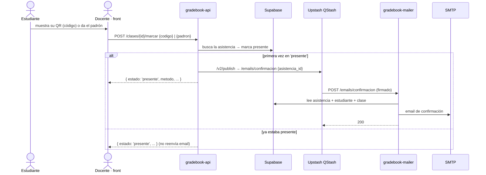
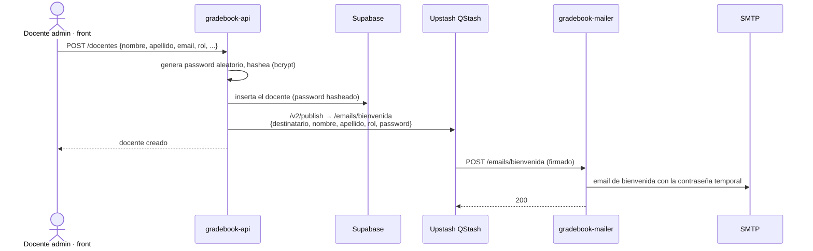
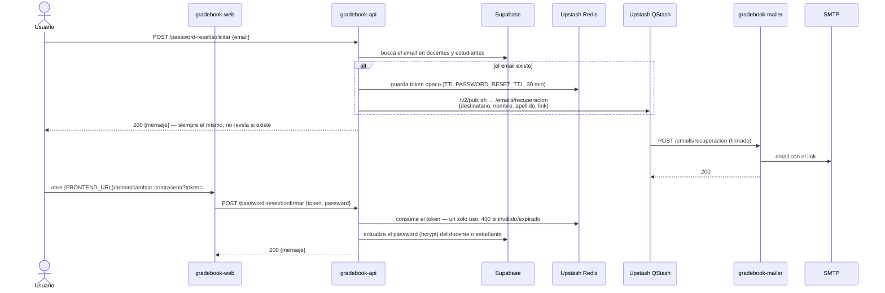

# Flujos

Diagramas de los flujos principales del sistema (Mermaid — se renderiza en GitHub).
Endpoints y payloads: [swagger.yaml](swagger.yaml). Contexto y decisiones del worker
de emails: [worker-asincrono-qrs.md](worker-asincrono-qrs.md).

## Vista general



La API **nunca** envía emails: publica el mensaje en QStash y el worker lo entrega por
SMTP de forma asincrónica. Sin `QSTASH_TOKEN`/`MAIL_WORKER_URL` (dev/tests), la API
loguea el payload que iría a la cola y `enviar-qrs` hace un dry-run (marca enviados).

## Envío de QRs de una clase

```mermaid
sequenceDiagram
    autonumber
    actor Doc as Docente · front
    participant API as gradebook-api
    participant Redis as Upstash Redis
    participant Q as Upstash QStash
    participant W as gradebook-mailer
    participant DB as Supabase
    participant SMTP as SMTP

    Doc->>API: POST /clases/{id}/enviar-qrs
    API->>Redis: lock asistencia:envio:{clase_id} (30s)
    opt reintentar=true
        API->>DB: reencolar envíos con_error (reset intentos/error)
    end
    API->>DB: ids pendientes (enviado=false, intentos < max)
    DB-->>API: asistencia_ids
    API->>Q: /v2/batch — un mensaje por cada 5 ids<br/>con Upstash-Delay escalonado (0s, Ns, 2Ns…)
    Q-->>API: 200 (lote aceptado)
    API->>Redis: marca asistencia:encolado:{clase_id} (300s)
    API-->>Doc: { encolados: N, total, enviados, con_error, quedan, completo }

    loop por mensaje (entrega escalonada; retry/backoff propio de QStash ante 5xx)
        Q->>W: POST /emails/qr-lote (JWT en Upstash-Signature)
        W->>W: verifica firma con qstash.Receiver (401 si no verifica)
        W->>DB: clase + asistencias del lote que siguen enviado=false
        loop por cada asistencia pendiente
            W->>W: genera PNG del QR
            W->>SMTP: envía el email (pausa + reintentos ante error transitorio)
            W->>DB: registrar_envio_asistencia (enviado=true | intentos+1 + error)
        end
        W-->>Q: 200 (fallas por email quedan registradas, no reintentan)
    end

    loop polling de progreso del front
        Doc->>API: GET /clases/{id}/envio
        API->>DB: conteos de envío
        API-->>Doc: { total, enviados, con_error, quedan, completo }
    end
```

Puntos clave:

- La respuesta del `POST /enviar-qrs` **no espera** a que se manden los emails:
  encola y devuelve el resumen. El front consulta `GET /clases/{id}/envio`.
- La marca `asistencia:encolado:{clase_id}` en Redis evita republicar los mismos
  pendientes mientras QStash aún los está entregando/reintentando. `reintentar=true`
  la saltea (camino para re-publicar algo que quedó trabado) y antes resetea los
  envíos `con_error`.
- El worker es idempotente: solo procesa las asistencias que siguen
  `enviado=false`, así un reintento de QStash no duplica emails.
- Un 5xx del worker (Supabase/SMTP caído) hace que QStash reintente el mensaje con
  backoff; errores de payload o por email responden 200 y no se reintentan.

### Modo dev (sin cola configurada)

Sin `QSTASH_TOKEN`/`MAIL_WORKER_URL` no hay QStash ni worker: `enviar-qrs` loguea
código y destinatario de cada pendiente y los marca `enviado=true` en lotes de
`limite` (dry-run), para que el polling del front complete igual.

## Ciclo de vida del envío (por fila de `asistencias`)



`Pendiente` cubre tanto "sin encolar" como "encolado en vuelo" — la diferencia está
en la marca `asistencia:encolado:{clase_id}` de Redis, no en la fila. El resumen del
polling cuenta `con_error` = no enviadas con `envio_intentos ≥ max`.

## Confirmación de asistencia



La confirmación solo se publica la **primera vez** que la asistencia pasa a
`presente`; marcar de nuevo no reenvía el email.

## Bienvenida a docente



La contraseña en claro solo existe en el payload (viaja por TLS hasta QStash y del
worker al SMTP); en la base queda el bcrypt. El worker no toca Supabase para este
email: todo viaja en el mensaje.

## Recuperación de contraseña



El token vive en Redis (no en la base) y se consume al confirmar — no puede
reutilizarse. La respuesta de `solicitar` es uniforme a propósito: evita enumerar
emails de la cátedra.
